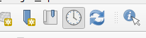

# FOSS4G 2025 NL Workshop 

## Opdrachten
In groepjes van 4

### Ontwikkelpad OGC APIs

#### Opdracht 1: 

- Bedenk queries met een relevante usecase die meer dan 10.000 records opleveren voor een OGC API Features. Beschikbare OGC APIs zijn te vinden op https://api.pdok.nl/. 
- Voer deze query uit met een GIS client naar keuze. : zoek een stukje in een van onze OGC APIs die over de grens van 10.000 features heen gaan.

Verbinden met een OGC API Features in QGIS:
1. **Zoek de API endpoint:** Zoek de root URL van de OGC API Features service die je wilt gebruiken. 
2. **Open QGIS:** Start QGIS en ga naar "Laag" `>` "Laag toevoegen" `>` WFS -OGC API feature laag toevoegen.
3. **Voeg de URL toe:** Klik op nieuw.
4. **Geef verbinding een naam**  Plak de URL van de OGC API Features service in het "URL" veld. Druk op OK.
5. **Verbinden:** Selecteer nieuwe verbiningen en Klik op "Verbinden" en QGIS zal proberen de gegevens op te halen.
6. **Selecteer de feature collectie:** Als de verbinding succesvol is, kun je de gewenste feature collectie selecteren in het dialoogvenster.
7. **Voeg toe aan kaart:** Klik op "Toevoegen" om de feature collectie aan je kaart toe te voegen.
8. **Zoom in naar juiste niveau om features te zien.**
9. _Voor PDOK OGC APIs en achtergrondkaarten:_ **Instaleer en Gebruik PDOK plugin** ( https://plugins.qgis.org/plugins/pdokservicesplugin/)
Ontwikkelpad OGC APIs

#### Opdracht 2: 
Download meer dan 1.000 records met een client naar keuze: 
- QGIS: kijk welke calls QGIS doet (`F12` in QGIS geeft toegang tot de logs).
- Verdieping: met `ogr2ogr`: download meer dan 1.000 records met ogr2ogr.
Ontwikkelpad OGC APIs

#### Opdracht 3 (gevorderden): 
- Download met `ogr2ogr` meer dan 1.000 records met ogr2ogr. Of creer een geopackage met bijvoorbeeld QGIS (vorige opdracht)
- Voer SQL Query uit en pagineer met een `LIMIT` en een `OFFSET` van `100` records per keer. 
- Hoeveel werk doet de database bij de 10e pagina t.o.v. de 1e pagina en waarom? 

### Omgang met tijd in OGC APIs

#### Opdracht 1: 
- Laad een temporele WMS van het KNMI van de [Minimum temperatuur van 1 dag](https://anonymous.api.dataplatform.knmi.nl/wms/adaguc-server?DATASET=Tn1) in in QGIS en stap hier doorheen in de tijd.
- Vergelijk deze met de [Neerslagradar forecast](https://anonymous.api.dataplatform.knmi.nl/wms/adaguc-server?DATASET=radar_forecast)
Maak een configuratie aan naar een temporele WMS (voorbeeld met QGIS 3.40.5):

https://anonymous.api.dataplatform.knmi.nl/wms/adaguc-server?DATASET=Tn1

Selecteer de juiste laag:

Bij het inladen is een klokje zichtbaar

Zo niet kies dan de juiste instelling bij Tijdbeheer laag:

Je kan nu tijdbeheer inschakelen middels het klokje op het lint bovenin:

Hiermee is nu door de temporele data heen te lopen: 

Omgang met tijd in OGC APIs

#### Opdracht 2: 
- Ga naar de wegdelen collectie van de OGC API Features [van de BGT](https://api.pdok.nl/lv/bgt/ogc/v1/collections/wegdeel) en zoek een bepaalde plek wegdelen zonder temporeel te filteren.
- Doe het zelfde en zoek nu wegdelen op een bepaald moment in de tijd.
- Laadt de zelfde data in QGIS in en zoek een manier om door deze data temporeel heen te lopen zoals bij de KNMI data.

### Omgang met standaardisatie
#### Opdracht 1A: 

- Zoek de naamgevingsconventie van APIs voor overheids APIs. [Antwoord](https://gitdocumentatie.logius.nl/publicatie/api/adr/2.0.2/#resources)
- Zoek de naamgevingsconventie van tabellen in Postgres ([antwoord (zie TIP)](https://www.postgresql.org/docs/17/ddl-basics.html#DDL-BASICS)).
- Zoek (max 1 minuut) een specificatie van REST ([antwoord](https://ics.uci.edu/~fielding/pubs/dissertation/rest_arch_style.htm#sec_5_2_1_1)).
- Hoe wordt er in bovenstaande specificaties en stijlen omgegaan met meervoud en enkelvoud?

#### Opdracht 1B: 

- Voldoet de [Straatmeubilair BGT collectie](https://api.pdok.nl/lv/bgt/ogc/v1/collections/straatmeubilair) aan de naamgevingsconventies? 
- Geef een advies aan PDOK hoe hier mee om te gaan. 

#### Opdracht 2: 
- Vraag geodata met andere CRS op in QGIS dan CRS84.
- Hoe gaat QGIS hiermee om?  